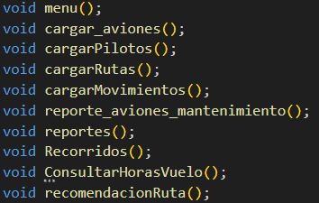

# MANUAL TECNICO
# LAB. ESTRUCTURAS DE DATOS SECCION A
## PRACTICA
### VACACIONES JUNIO 2024

```js
👻💀💀💀💀💀💀💀💀💀💀💀💀💀💀💀💀💀💀👻
💀                                           💀
💀   Universidad San Carlos de Guatemala     💀
💀   Programador: Josué Nabí Hurtarte Pinto  💀   
💀   Carnet: 202202481                       💀       
💀   Correo: josuepinto013@gmail.com         💀   
💀                                           💀       
👻💀💀💀💀💀💀💀💀💀💀💀💀💀💀💀💀💀💀👻
```
---

## Descripcion general del proyecto
<p style="text-align: justify;">
Se desarrolló un sistema de gestión de información de vuelos utilizando varias estructuras de datos avanzadas. El objetivo principal es aplicar los conocimientos sobre estructuras de datos complejas y su uso eficiente en la organización y búsqueda de información. Se gestionaron vuelos y destinos usando una lista circular doble, un árbol binario de búsqueda, un árbol B, una matriz dispersa, una tabla hash y una lista de adyacencia. La aplicación permite realizar operaciones de inserción, eliminación y búsqueda de datos de manera eficiente, garantizando una óptima gestión de la información relacionada con los vuelos.
</p>

## Requerimientos mínimos del entorno de desarrollo
* IDE (Entorno de Desarrollo Integrado) en nuestro caso usamos el editor de texto Visual Studio Code.
* C++ (Instalando las extensiones en Visual Studio Code).
* Libreria para lectura de json  [Link de Repositorio](https://github.com/open-source-parsers/jsoncpp).
* Graphviz 
* Git: Es muy recomendable un control de versiones para gestionar y no perder cambios.


# CLASES Y SUS METODOS

## Clase Avion

* Constructor: Inicializa un objeto Avion con los detalles del vuelo, número de registro, modelo, capacidad, aerolínea, ciudad de destino y estado.

* Getters: Proporcionan acceso a los atributos privados del avión: vuelo, número de registro, modelo, capacidad, aerolínea, ciudad de destino y estado.

* Destructor: Libera cualquier recurso asociado con el objeto Avion al finalizar su uso.

```c++
class Avion {
public:
    // Constructor
    Avion(const std::string &vuelo, const std::string &numeroRegistro, const std::string &modelo, int capacidad, const std::string &aerolinea, const std::string &ciudad_destino, const std::string &estado) 
        : vuelo(vuelo), numeroRegistro(numeroRegistro), modelo(modelo), capacidad(capacidad), aerolinea(aerolinea), ciudad_destino(ciudad_destino), estado(estado) {}

    // Getters
    std::string getVuelo() const { return vuelo; }
    std::string getNumeroRegistro() const { return numeroRegistro; }
    std::string getModelo() const { return modelo; }
    int getCapacidad() const { return capacidad; }
    std::string getAerolinea() const { return aerolinea; }
    std::string getCiudadDestino() const { return ciudad_destino; }
    std::string getEstado() const { return estado; }

    ~Avion() {}

private:
    std::string vuelo;
    std::string numeroRegistro;
    std::string modelo;
    int capacidad;
    std::string aerolinea;
    std::string ciudad_destino;
    std::string estado;
};
```

## Clase Piloto

* Constructor: Inicializa un objeto Piloto con todos sus atributos dados, incluyendo nombre, nacionalidad, número de identificación, vuelo asignado, horas de vuelo y tipo de licencia.

* Métodos Getters: Proporciona métodos públicos para obtener los valores de cada atributo privado de la clase, tales como nombre, nacionalidad, número de identificación, vuelo asignado, horas de vuelo y tipo de licencia.

* Puntero siguiente: Un puntero a otro objeto Piloto, permitiendo la implementación de una lista enlazada para gestionar múltiples pilotos.

```c++
class Piloto {
public:
    std::string nombre;
    std::string nacionalidad;
    std::string numero_de_id;
    std::string vuelo;
    int horas_de_vuelo;
    std::string tipo_de_licencia;

    Piloto* siguiente;

    Piloto(std::string nombre, std::string nacionalidad, std::string numero_de_id, std::string vuelo, int horas_de_vuelo, std::string tipo_de_licencia)
        : nombre(nombre), nacionalidad(nacionalidad), numero_de_id(numero_de_id), vuelo(vuelo), horas_de_vuelo(horas_de_vuelo), tipo_de_licencia(tipo_de_licencia) {}

    // Getters
    std::string getNombre() const { return nombre; }
    std::string getNacionalidad() const { return nacionalidad; }
    std::string getNumeroDeId() const { return numero_de_id; }
    std::string getVuelo() const { return vuelo; }
    int getHorasDeVuelo() const { return horas_de_vuelo; }
    std::string getTipoDeLicencia() const { return tipo_de_licencia; }
    
};
```

## Clase ruta

* Constructor: Inicializa un objeto Ruta con los atributos de origen, destino y distancia.

* Métodos Getters: Proporciona métodos públicos para obtener los valores de cada atributo privado de la clase, tales como el origen, destino y distancia de la ruta.

* Destructor: Define un destructor para la clase Ruta, aunque en este caso no realiza ninguna acción específica ya que no hay recursos dinámicos que necesiten liberarse explícitamente.

```c++
class Ruta {
public:
    Ruta(const std::string &origen, const std::string &destino, int distancia): origen(origen), destino(destino), distancia(distancia) {}

    std::string getOrigen() const { return origen; }
    std::string getDestino() const { return destino; }
    int getDistancia() const { return distancia; }

    ~Ruta() {}

private:
    std::string origen;
    std::string destino;
    int distancia;
};
```
# Main


## menu

Presenta el menú principal con las opciones disponibles para el usuario.

## cargar_aviones

Carga los datos de los aviones desde un archivo JSON y los inserta en las estructuras de datos correspondientes (árbol de aviones disponibles, lista de aviones en mantenimiento, matriz de vuelos y ciudades).

## cargarPilotos

Carga los datos de los pilotos desde un archivo JSON y los inserta en las estructuras de datos correspondientes (árbol binario de búsqueda de pilotos, tabla hash de pilotos, matriz de vuelos y ciudades).

## cargarRutas

Carga las rutas desde un archivo de texto y las añade a la lista de adyacencia del grafo de rutas.

## cargarMovimientos

Carga los movimientos desde un archivo de texto y actualiza las estructuras de datos según los movimientos (ingreso y salida de aviones de mantenimiento, baja de pilotos).

## reporte_aviones_mantenimiento

Genera un reporte gráfico en formato DOT y PNG de la lista de aviones en mantenimiento utilizando Graphviz.

## recomendacionRuta

Solicita al usuario la ciudad de origen y destino, y muestra la ruta más corta entre ambas ciudades usando la lista de adyacencia.

## reportes

Presenta un submenú para generar diferentes reportes (árbol B de aviones disponibles, lista de aviones en mantenimiento, árbol binario de búsqueda de pilotos, tabla hash de pilotos, grafo dirigido de rutas, matriz dispersa de vuelos y ciudades).

## Recorridos

Presenta un submenú para realizar diferentes recorridos (pre-orden, in-orden, post-orden) en el árbol binario de búsqueda de pilotos.


## Codigo -> [main.cpp](../main.cpp)

<br><br>

# ESTRUCTURAS

## Lista Circular Doble

* Constructor y Destructor: El constructor inicializa una lista circular doblemente enlazada vacía. El Destructor libera la memoria ocupada por todos los nodos en la lista, llamando al método clear().


* insert: Inserta un nuevo nodo con el valor value al final de la lista. Si la lista está vacía, el nuevo nodo se convierte en el primer y último nodo. Si no está vacía, el nuevo nodo se inserta al final y los punteros next y prev se actualizan adecuadamente para mantener la estructura circular.

* remove: Elimina el primer nodo que contiene el valor value. Si el nodo a eliminar es el único nodo en la lista, se actualizan first y last a nullptr. Si es el primer nodo, se actualiza first al siguiente nodo. Si es el último nodo, se actualiza last al nodo anterior. Si está en el medio, los punteros next y prev de los nodos vecinos se actualizan adecuadamente.

* getSize: Devuelve el número de elementos en la lista.

* getElement: Devuelve el valor del nodo en la posición especificada por indice. Si el índice está fuera de rango, lanza una excepción.

* isEmpty: Verifica si la lista está vacía.

* Clear: Elimina todos los nodos de la lista y libera la memoria correspondiente, dejando la lista vacía.

*  print: Imprime los valores de todos los nodos en la lista en orden, Si la lista está vacía, imprime un mensaje indicando que la lista está vacía.

* buscarPorNumeroDeRegistro: Busca un nodo por su número de registro y devuelve un puntero al nodo que contiene el número de registro especificado.

* eliminarPorNumeroDeRegistro: Elimina el nodo que contiene el número de registro especificado.

## codigo -> [DoubleCircularList.h](../src/DoubleCircularList.h) 
<br><br>


## Arbol Binario de Busqueda

* ArbolBB:Constructor de la clase. Inicializa la raíz del árbol como nullptr.

* estaVacio: Verifica si el árbol está vacío. Retorna true si la raíz es nullptr, de lo contrario, retorna false.


* insertar: Inserta un nodo con el objeto Piloto proporcionado en el árbol binario de búsqueda.


* buscarPorId: Busca un nodo en el árbol basado en el ID del piloto. Llama a la función recursiva buscarPorId(id, nodoPtr).

* RecorridoPreOrden: Realiza un recorrido en preorden del árbol. Llama a la función recursiva 
RecorridoPreOrden(nodoPtr).

* RecorridoInOrden: Realiza un recorrido en inorden del árbol. Llama a la función recursiva RecorridoInOrden(nodoPtr).

* RecorridoPostOrden: Realiza un recorrido en postorden del árbol. Llama a la función recursiva RecorridoPostOrden(nodoPtr).

* generarReporte: Genera un reporte visual del árbol en formato DOT y lo guarda como una imagen PNG. Llama a la función imprimirNodo(nodoPtr) para generar el contenido del archivo DOT.

* *imprimirNodo**: Función auxiliar que genera las relaciones entre los nodos en el archivo DOT para crear el reporte visual del árbol.

* *eliminarNodoPorID**: Elimina un nodo del árbol basado en el ID del piloto. Maneja tres casos: nodo hoja, nodo con un hijo, y nodo con dos hijos. Retorna el nuevo subárbol después de la eliminación.

* eliminarPiloto: Elimina un nodo del árbol basado en el ID del piloto. Llama a la función eliminarNodoPorID(nodo, numero_de_id).

* ~ArbolBB(): Destructor de la clase. Maneja la limpieza y liberación de memoria del árbol.

## Codigo -> [arbolBB.h](../src/arbolBB.h)
<br><br>

## Arbol B

* ArbolB: Constructor de la clase. Inicializa la raíz del árbol como nullptr.

* recorrer: Realiza un recorrido del árbol y muestra los números de registro de los aviones almacenados.

* search: Busca un nodo en el árbol basado en el número de registro del avión. Retorna el nodo que contiene el número de registro si lo encuentra, de lo contrario, retorna nullptr.

* insert: Inserta un avión en el árbol B. Si la raíz es nullptr, crea un nuevo nodo y lo establece como la raíz. Si la raíz está llena, crea un nuevo nodo, divide la raíz, y luego inserta el avión en el lugar correcto.

* generarDot: Genera un archivo DOT para visualizar el árbol B. Crea una representación gráfica del árbol y la guarda como una imagen PNG.

* Deletear: Elimina un avión del árbol basado en su número de registro. Si después de la eliminación la raíz está vacía, ajusta la raíz adecuadamente.

* buscarAvion: Busca un avión en el árbol basado en su número de registro. Retorna el avión si lo encuentra, de lo contrario, retorna nullptr.

* NodoB: Clase que representa un nodo en el árbol B.

* NodoB(bool _hoja): Constructor de la clase NodoB. Inicializa el nodo, establece si es hoja o no y configura sus hijos como nullptr.

* insertNoFull(Avion *avion): Inserta un avión en un nodo que no está lleno. Si el nodo es una hoja, inserta el avión directamente. Si no es una hoja, encuentra el hijo apropiado y lo inserta allí, dividiendo el hijo si es necesario.

* splitChild(int i, NodoB *y): Divide un nodo hijo que está lleno. Crea un nuevo nodo z que contiene la mitad de los elementos de y, y ajusta las referencias en el nodo actual y en y.

* recorrer: Realiza un recorrido del nodo y muestra los números de registro de los aviones almacenados.

* search(string numero_de_registro): Busca un avión en el nodo basado en el número de registro. Retorna el nodo que contiene el avión si lo encuentra, de lo contrario, sigue buscando en los hijos.

* generarDot(ofstream &archivo, int &nodoId): Genera el contenido del archivo DOT para el nodo actual, incluyendo los aviones y las relaciones con los hijos. Establece estilos visuales para la representación gráfica.

* deleteRecursive(string numero_de_registro): Elimina un avión del nodo basado en su número de registro. Ajusta el nodo después de la eliminación si es necesario, manejando casos de nodos hoja y nodos no hoja.

* searchRecursive(string numeroRegistro): Busca un avión en el nodo y sus hijos de manera recursiva basado en el número de registro. Retorna el avión si lo encuentra, de lo contrario, retorna nullptr.

## Codigo -> [arbolB.h](../src/arbolB.h)
<br><br>

## Tabla Hash

* Constructor de la clase: Inicializa la tabla hash con el tamaño dado y establece todas las entradas a nullptr.

* Destructor de la clase: Elimina todos los elementos de la tabla hash y libera la memoria asignada.

* Función de hash: Calcula el índice de la tabla hash a partir de una clave dada convirtiendo los caracteres de la clave a valores ASCII y sumándolos.

* Insertar: Inserta un nuevo objeto Piloto en la tabla hash en la posición calculada por la función de hash.

* Buscar: Busca un objeto Piloto en la tabla hash utilizando la clave numero_de_id y devuelve un puntero a este objeto si se encuentra.

* Eliminar: Elimina un objeto Piloto de la tabla hash que corresponde a la clave numero_de_id.

* Generar gráfico: Genera una representación gráfica de la tabla hash en formato DOT y crea una imagen PNG de esta representación.

## Codigo -> [Hash.h](../src/Hash.h)
<br><br>

## Lista de Adyacencia

* Constructor de Edge: Inicializa una arista con el destino y la distancia dados.

* Constructor de NODOAL: Inicializa un nodo con el origen dado y una lista vacía de aristas.

* findNODOAL: Busca y devuelve un puntero al nodo con el origen especificado, o nullptr si no se encuentra.

* findIndexNODOAL: Busca y devuelve el índice del nodo con el nombre especificado, o -1 si no se encuentra.

* findShortestPath: Encuentra y devuelve la ruta más corta y su distancia total entre dos nodos usando un algoritmo de búsqueda en profundidad con memoización de distancias mínimas.

* addEdge: Añade una nueva arista a la lista de adyacencia entre el nodo origen y el nodo destino con la distancia especificada.

* displayList: Muestra la lista de adyacencia en la consola, imprimiendo cada nodo y sus aristas.

* shortestPath: Encuentra y devuelve la ruta más corta y su distancia total entre dos nodos específicos utilizando la función findShortestPath.

* generarGrafoGraphviz: Genera un archivo DOT para la visualización del grafo dirigido y crea una imagen PNG a partir de este archivo, mostrando la estructura del grafo con las rutas y distancias

## Codigo -> [Grafo.h](../src/Grafo.h)
<br><br>

## Matriz Dispersa 

* MatrizDispersa: Constructor que inicializa la matriz dispersa con un nodo origen nulo.

* insertarFila: Inserta una nueva fila en la matriz con el vuelo especificado. Devuelve un puntero al nuevo nodo de fila.

* insertarColumna: Inserta una nueva columna en la matriz con la ciudad destino especificada. Devuelve un puntero al nuevo nodo de columna.

* insertarNodoEnFila: Inserta un nodo en una fila existente en la posición especificada por el vuelo y la ciudad destino.

* buscarFila: Busca y devuelve un puntero al nodo de la fila con el vuelo especificado, o nullptr si no se encuentra.

* insertarNodo: Inserta un nuevo nodo en la matriz en la posición especificada por el vuelo y * la ciudad destino, y asigna el número de ID proporcionado.

* buscarNodo: Busca y devuelve un puntero al nodo con el vuelo y la ciudad destino especificados, o nullptr si no se encuentra.

* buscarNodoVacioEnFila: Busca y devuelve un puntero al primer nodo vacío (sin número de ID) en la fila especificada, o nullptr si no se encuentra.

* insertarAvion: Inserta un avión en la matriz usando el vuelo y la ciudad destino del avión.

* insertarPiloto: Inserta un piloto en la matriz usando el vuelo del piloto y busca un nodo vacío para asignarle el número de ID del piloto.

* imprimirMatriz: Imprime la matriz en la consola, mostrando cada nodo con su vuelo, ciudad destino y número de ID.

* buscarPorNumeroDeID: Busca y devuelve un puntero al nodo con el número de ID especificado, o nullptr si no se encuentra.

* eliminarPorNumeroDeID: Elimina el nodo con el número de ID especificado, borrando el número de ID del nodo.

* generarGraficoGraphviz: Genera un archivo DOT para la visualización de la matriz dispersa y crea una imagen PNG a partir de este archivo, mostrando la estructura de la matriz con vuelos, ciudades destino y números de ID.

## Codigo -> [Matriz.h](../src/Matriz.h)
<br><br>
<p align="center">
  <a href="#"></a>
</p>